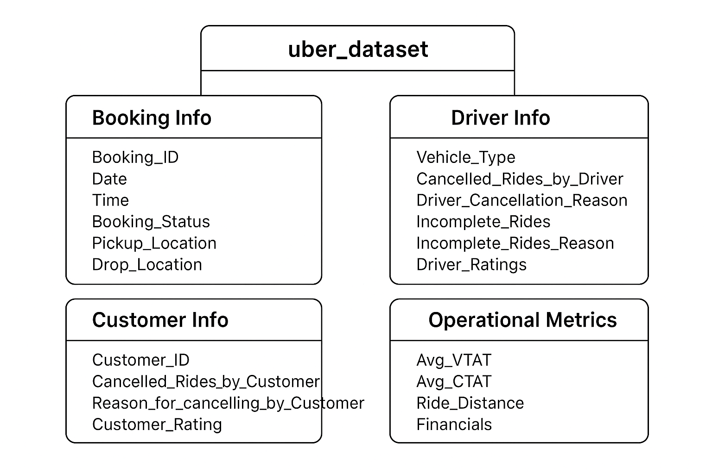

# 🚖 Uber Ride Analytics Project

## 📌 Deskripsi
Project ini bertujuan untuk menganalisis data perjalanan **Uber** menggunakan **SQL, Python, dan BI Tools**.  
Analisis mencakup pola pemesanan, perilaku customer & driver, pembatalan perjalanan, hingga insights finansial.  

## 📂 Dataset
- Sumber Data: [Uber Ride Analytics Dataset 2024](https://www.kaggle.com/datasets/yashdevladdha/uber-ride-analytics-dashboard)
- Deskripsi Kolom:

| Kolom                           | Tipe Data   | Deskripsi |
|--------------------------------|-------------|-----------|
| `Date`                         | Date        | Tanggal pemesanan ride (YYYY-MM-DD). |
| `Time`                         | Time        | Waktu pemesanan ride (HH:MM:SS). |
| `Booking_ID`                   | String      | ID unik untuk setiap booking. |
| `Booking_Status`               | String      | Status ride (contoh: Completed, Incomplete, No Driver Found). |
| `Customer_ID`                  | String      | ID unik customer yang memesan. |
| `Vehicle_Type`                 | String      | Tipe kendaraan (e.g., Auto, Bike, Go Sedan, Premier Sedan, eBike, Uber XL). |
| `Pickup_Location`              | String      | Lokasi penjemputan. |
| `Drop_Location`                | String      | Lokasi tujuan. |
| `Avg_VTAT`                     | Float       | Rata-rata Vehicle Turnaround Time (menit). |
| `Avg_CTAT`                     | Float       | Rata-rata Customer Turnaround Time (menit). |
| `Cancelled_Rides_by_Customer`  | Integer     | Jumlah pembatalan ride oleh customer. |
| `Reason_for_cancelling_by_Customer` | String | Alasan customer membatalkan (jika ada). |
| `Cancelled_Rides_by_Driver`    | Integer     | Jumlah pembatalan ride oleh driver. |
| `Driver_Cancellation_Reason`   | String      | Alasan driver membatalkan (jika ada). |
| `Incomplete_Rides`             | Integer     | Jumlah rides yang tidak selesai. |
| `Incomplete_Rides_Reason`      | String      | Alasan ride tidak selesai (jika ada). |
| `Booking_Value`                | Numeric     | Nilai booking (biasanya dalam mata uang lokal, misalnya rupees). |
| `Ride_Distance`                | Float       | Jarak perjalanan dalam kilometer. |
| `Driver_Ratings`               | Float       | Rating yang diberikan untuk driver (skala 1–5). |
| `Customer_Rating`              | Float       | Rating yang diberikan untuk customer (skala 1–5). |
| `Payment_Method`               | String      | Metode pembayaran yang digunakan (e.g., UPI, Debit Card). |

## 🎯 Business Questions

1. **Booking & Customer Behavior**
   - Berapa jumlah total booking per hari / per bulan?
   - Lokasi pickup dan drop paling populer?
   - Jam berapa terjadi permintaan ride tertinggi?

2. **Driver & Vehicle Analysis**
   - Jenis kendaraan apa yang paling banyak digunakan?
   - Distribusi jarak perjalanan per vehicle type?

3. **Cancellations & Incomplete Rides**
   - Persentase booking yang dibatalkan customer vs driver.
   - Alasan paling umum pembatalan oleh customer/driver.
   - Seberapa besar incomplete rides terhadap total booking?

4. **Financial Insights**
   - Rata-rata nilai booking per trip.
   - Total revenue per bulan.
   - Korelasi jarak perjalanan dengan booking value.

5. **Customer & Driver Ratings**
   - Distribusi rating customer & driver.
   - Pola rating rendah pada jam sibuk?
   - Hubungan metode pembayaran dengan rating?

## ⚙️ Tools yang Digunakan
- **SQL** → SQLite untuk query & agregasi data.  
- **Python** → Pandas, Matplotlib, Seaborn untuk EDA & visualisasi.  
- **BI Tools** → Power BI / Tableau untuk dashboard interaktif.

## 📌 Deliverables
📂 SQL Queries → queries.sql
📂 Python Notebook → uber_eda.ipynb
📂 Dashboard → uber_dashboard.pbix / uber_dashboard.twb
📂 Dokumentasi → README.md ini

## 🚀 Insights yang Diharapkan
- Mengetahui tren permintaan ride harian & bulanan.
- Menemukan faktor utama pembatalan ride.
- Menilai performa driver & customer berdasarkan rating.
- Memberikan rekomendasi strategi untuk meningkatkan kepuasan customer & efisiensi operasional.

## 📊 Entity Relationship Diagram (ERD)

## 🔎 SQL Analysis
Berikut Query dan hasil analisis:
1. Lokasi terpopuler

## 📑 Exploratory Data Analysis (EDA) with Python
Visualisasi + Insight

## ✅ Kesimpulan & Rekomendasi
